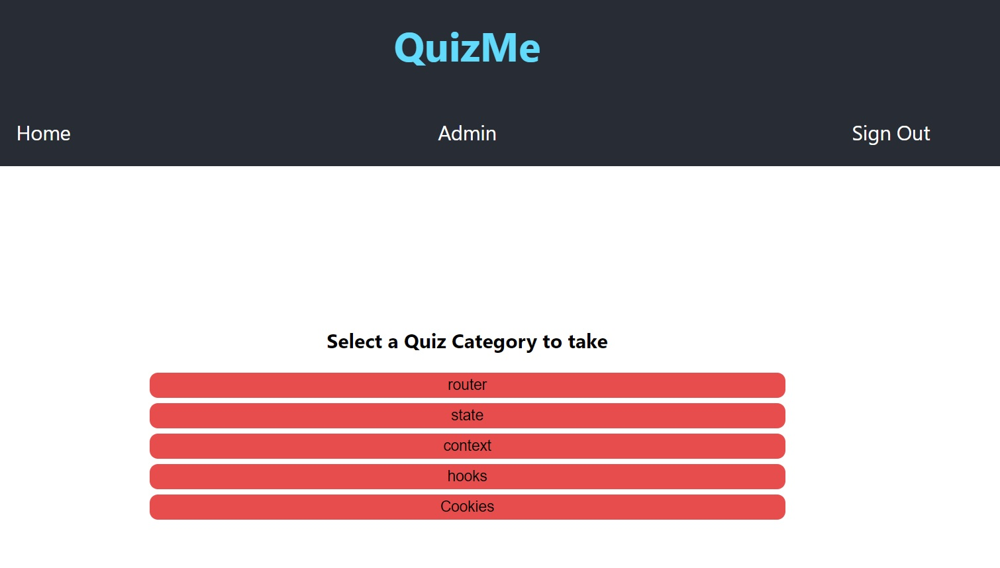

# Quiz Me App!

[LIVE QuizMe APP](https://quizme.vercel.app).

---
## Description:

This application stores quiz categories, questions, and user answers to collect data and allow administrators of the web page to create informed decisions about their teaching practices based on student's responses. User registration and login required. Once logged in, token is provided which contains user information and whether a user is an admin. Without the token, an unauthorized request message will be returned.

---
## Stack Used:

CSS, HTML, ReactJS, JS

---
## Start
*Page contains header that allows users to either log in or create a new account. Must use admin account to make changes to the quizes.*

---
## Dashboard
*Page displays progress for each quiz category pertaining to each account. Allows users to take all the quiz questions or focus on a specific category.*

---
## Quiz Category
*Page allows user to select a specific quiz category to answer.*

---
## Quiz Page
*User can answer questions in multiple choice format.*

---
## Admin Page
*Admin account displays admin link in header to allow deletion or creation of quiz categories and quiz questions.
Can toggle between editing questions or answers with the first set of buttons. Click create button to create a new entry, click cancel to return to delete options.*

---
## Non Admin Dashboard
*Regular account does not display admin link in header.*

